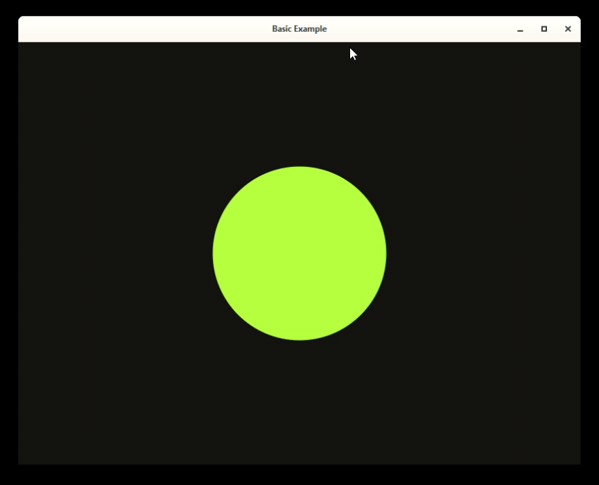

# Quick start

In this section you will learn how to use Lynx to build your apps.

Make sure to have the `Lynx.jl` package installed, as usual with:

```
julia> ] add Lynx
```

## Basic example

First, don't forget to load the package:

```julia
using Lynx
```

Since we are gonna use the [`Luxor.jl`](#) package a lot for drawing
operations, it makes sense to install as a direct dependency as well.

```
julia> ] add Luxor
```

Then, load with:

```julia
using Luxor
```

There are two different ways to use `Lynx` to create visualizations: using a [`LynxApp`](@ref) or using [`Widget`](@ref)s to build the UI. We are gonna use the `LynxApp` to build this first example.

The [`LynxApp`](@ref) contains everything we need to build a simple visualization app: a [`Canvas`](@ref), a [`Window`](@ref) and a
[`Layout`](@ref) mechanism to determine how the widgets are displayed.

First, we create our `LynxApp` using the [`init`](@ref) function:

```julia
Lynx.init("Basic Example", 800, 600)
```

The [`init`](@ref) function expects the `title`, `width` and `height` of the window as parameters.

Then, we define our `setup` and `update` functions:

```julia
function setup()
    @info "Canvas width is $(@width) and height is $(@height)"
end
```

The `setup` function is optional. It is useful for initialization. For example, when you need to know the `width` and `height` of the [`Canvas`](@ref).

Then, we create our `update` function.

```julia
time = 0.0 # the amount of time that has passed

function update(dt)
    background("#111")
    sethue("yellowgreen")
    origin()

    radius = 50 * (cos(time) + 2)
    circle(O, radius, :fill)

    # update the time
    global time += dt
end
```

We also define a `time` variable to keep track on how much time
has passed since the first frame.

The `update` function expects a single argument `dt`, which is the
amount of time between the last and the current frame.

Then, we run our application using the [`run!`](@ref) function, passing
the `update` and `setup` functions:

```julia
run!(update, setup)
```

Here is all the code for this example:

```julia
using Lynx
using Luxor

Lynx.init("Basic Example", 800, 600)

function setup()
    @info "Canvas width is $(@width) and height is $(@height)"
end

time = 0.0 # the amount of time that has passed

function update(dt)
    background("#111")
    sethue("yellowgreen")
    origin()

    radius = 50 * (cos(time) + 2)
    circle(O, radius, :fill)

    # update the time
    global time += dt
end

run!(update, setup)
```

If you run the code above in the julia `REPL`, the output will look
like this:

